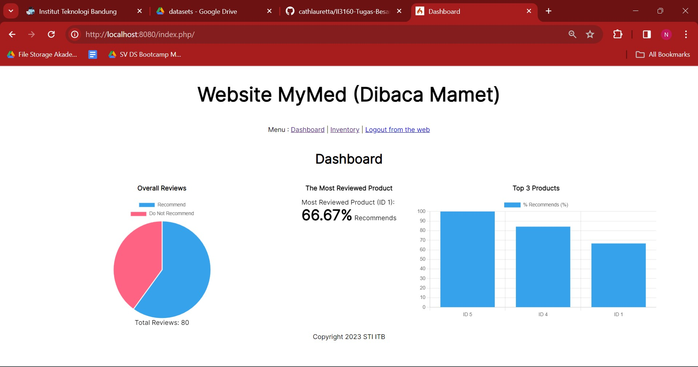
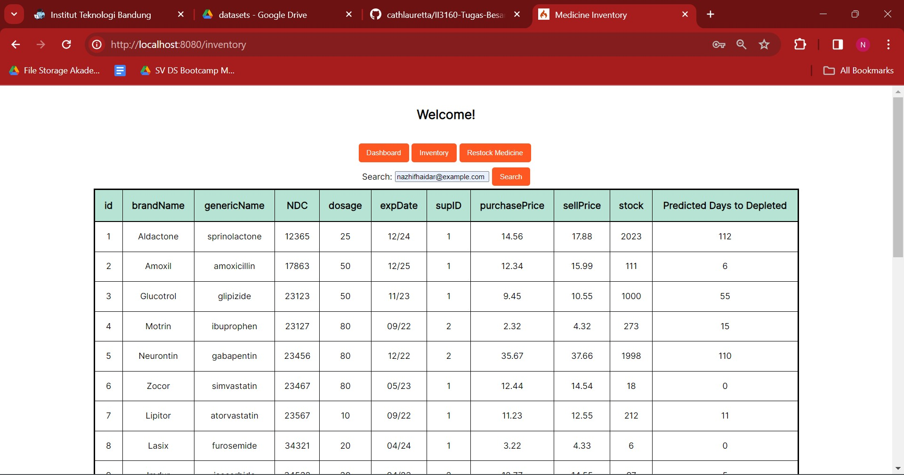
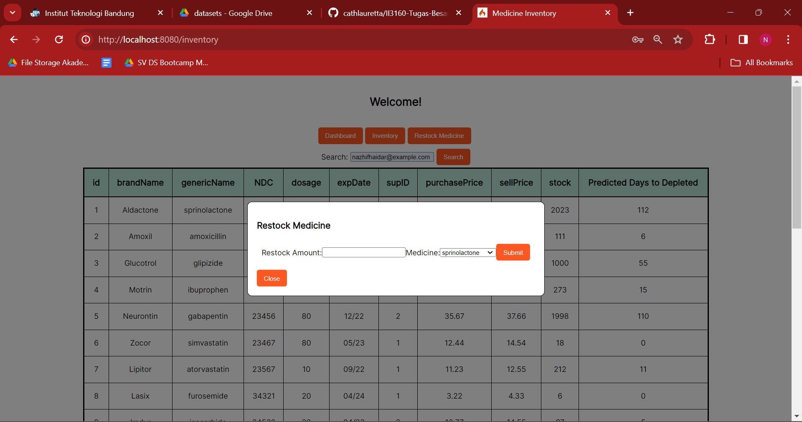

# Pharmacy - Inventory Management
## Tugas Besar II3160 Teknologi Sistem Terintegrasi
Medicine Inventory Management System is a system used to stored any data and information of medicines in a pharmacy. This system uses an API from [Medicine Review System](https://github.com/cathlauretta/II3160-pharmacy-review) to show summary of medicine products recommendations.

## Table of Contents
- [Requirements](#requirements)
- [How to Run the Program](#how-to-run-the-program)
- [Program Usage Guide](#program-usage-guide)
- [Authors](#authors)

## Requirements
- [CodeIgniter4](https://github.com/codeigniter4/CodeIgniter4)
- [XAMPP](https://www.apachefriends.org/)
- Code Editor, such as [Visual Studio Code](https://code.visualstudio.com/download)

## How to Run the Program
1. Clone this repository
    ```bash
    git clone https://github.com/cathlauretta/II3160-pharmacy-inventory.git
    ```

2. Change directory to the cloned repository
    ```bash
    cd II3160-pharmacy-inventory
    ```

3. Install the required dependencies
    ```bash
    php composer.phar install
    ```

4. Open http://localhost/phpmyadmin/ and insert the `DRUGS.sql` to the database

5. Adjust the `env.example` to your environment configuration

6. Run this command and open http://localhost:8080/
    ```bash
    php spark serve
    ```

## Program Usage Guide
User must do login first to access the system. You can use the dummy account from our sql


Dashboard shows the insight of the medicine review from the other system


Inventory menu shows the information of medicine. Our system can predict how much days left until the medicine need to restock


User can input how many medicine to restock


## Author
| Student ID | Name |
|---|---|
| 18221053 | Laurentia Kayleen Christopher |
| 18221083 | Nazhif Haidar Putra Wibowo |
| 18221157 | Cathleen Lauretta |